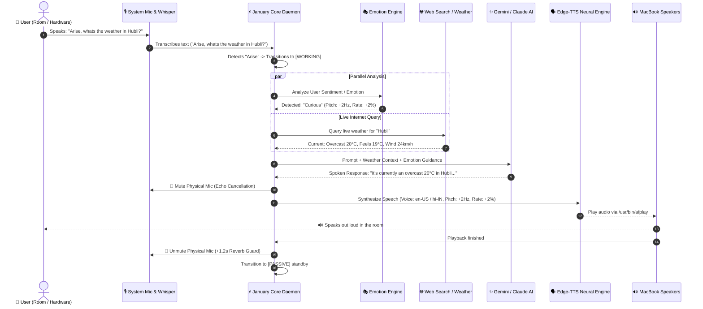

# ⚡ January AI (`january.systems`)
> **An emotionally expressive, local autonomous AI companion and OS assistant running on macOS, powered by Google Gemini, Anthropic Claude 3.7 Sonnet, and open-source neural audio engines.**

---

## 🌟 Overview

**January** is an intelligent, emotionally attuned operating system agent designed to run autonomously on your laptop. It listens directly to your MacBook's physical microphone using local **Faster-Whisper** speech-to-text, analyzes queries with **Google Gemini 3.6 Flash** and **Anthropic Claude 3.7 Sonnet**, queries real-time internet search and live weather data, and vocalizes warm, human-like responses through your physical laptop speakers using **Microsoft Edge-TTS** neural voices.

January operates in two seamless modes:
1. **Autonomous Background Daemon (`npm run dev`)**: Runs headlessly in the background, listening for wake phrases (**"Arise"**) and voice commands in the room even with no windows open.
2. **Interactive Terminal CLI (`npm run cli`)**: A dual-section REPL (`[ME]` & `[JANUARY]`) that automatically pauses the background microphone while you interact and resumes background listening upon exit.

---

## 🏛️ System Architecture Flowchart

```
+-----------------------------------------------------------------------------------+
|                            JANUARY AI SYSTEM ARCHITECTURE                         |
+-----------------------------------------------------------------------------------+
|                                                                                   |
|  [ PHYSICAL INPUTS ]                                                              |
|   +--------------------------+       +-----------------------------------------+  |
|   | 🎙️ MacBook Microphone    |       | 💻 Interactive Terminal CLI ([ME])       |  |
|   | (16kHz PCM via sounddevice)      | (Command input, questions, code request)|  |
|   +------------+-------------+       +--------------------+--------------------+  |
|                |                                          |                       |
|                v                                          v                       |
|  [ BACKGROUND DAEMON COORDINATOR ]           [ CLI AUTO-PAUSE/RESUME CONTROLLER ] |
|   +------------------------------------+      +--------------------------------+  |
|   | ⚡ Voice Activity Detection (VAD)   |<---->| ⏸️  Pauses background mic while  |  |
|   | 🗣️ Faster-Whisper (multilingual)   |      |     CLI is attached & active.  |  |
|   +-----------------+------------------+      +--------------------------------+  |
|                     |                                                             |
|                     v                                                             |
|   +----------------------------------------------------------------------------+  |
|   | 🧠 Central Agent Coordinator & State Machine                               |  |
|   |    [PASSIVE]  <---->  [LISTENING]  <---->  [WORKING]  <---->  [SPEAKING]   |  |
|   |                                  ^                                         |  |
|   |                                  | (Sleep Word: "good night" / "Arise")    |  |
|   |                                  v                                         |  |
|   |                             [SLEEPING]                                     |  |
|   +-----------------+--------------------+--------------------+---------------+  |
|                     |                    |                    |                   |
|                     v                    v                    v                   |
|  [ INTELLIGENCE ENGINES & TOOLS ]                                                 |
|   +-------------------------+  +------------------------+  +-------------------+  |
|   | 🎭 Local Emotion Engine |  | 🌐 Real-Time Internet  |  | 🛠️ Anthropic Claude|  |
|   | - 7 Mood Archetypes     |  | - DuckDuckGo Search    |  |    3.7 Sonnet     |  |
|   | - Valence & Arousal     |  | - wttr.in Live Weather |  | - Code Generation |  |
|   | - Dynamic Prosody Tuning|  | - Wikipedia Facts      |  | - Interactive Apps|  |
|   +------------+------------+  +-----------+------------+  +---------+---------+  |
|                |                           |                         |            |
|                +---------------------------+-------------------------+            |
|                                            |                                      |
|                                            v                                      |
|                              +--------------------------+                         |
|                              | ✨ Google Gemini API     |                         |
|                              | (gemini-3.6-flash / 3.5) |                         |
|                              +-------------+------------+                         |
|                                            |                                      |
|                                            v                                      |
|  [ VOCAL SYNTHESIS & OUTPUT ]                                                     |
|   +----------------------------------------------------------------------------+  |
|   | 🔤 Unicode Script & Language Classifier                                    |  |
|   | (Auto-detects Hindi, Bengali, Marathi, Gujarati, Urdu, Sanskrit, etc.)     |  |
|   +----------------------------------------+-----------------------------------+  |
|                                            |                                      |
|                                            v                                      |
|   +----------------------------------------------------------------------------+  |
|   | 🗣️ Microsoft Edge-TTS Multilingual Neural Voice Router                     |  |
|   | (Pitch & Rate modulated by Emotion Engine: +4Hz Joy, -2Hz Empathetic, etc.)|  |
|   +----------------------------------------+-----------------------------------+  |
|                                            |                                      |
|                                            v                                      |
|   +----------------------------------------------------------------------------+  |
|   | 🔊 MacBook Physical Speakers (/usr/bin/afplay)                             |  |
|   +----------------------------------------------------------------------------+  |
+-----------------------------------------------------------------------------------+
```

---

## 🔄 End-to-End Voice Lifecycle & Reverb Guard (Sequence Flow)



---

## 💻 Terminal CLI & Background Daemon Auto-Switching Flow

```
+-----------------------------------------------------------------------------------+
|                  TERMINAL CLI & BACKGROUND AUTO-SWITCHING FLOW                    |
+-----------------------------------------------------------------------------------+
|                                                                                   |
|           +----------------------------------------------------------+            |
|           |       January Background Daemon Running (npm run dev)    |            |
|           |       - Physical microphone ACTIVE & LISTENING           |            |
|           |       - Ready for "Arise" or spoken voice prompts        |            |
|           +----------------------------+-----------------------------+            |
|                                        |                                          |
|                     User launches:     | `npm run cli`                            |
|                                        v                                          |
|           +----------------------------------------------------------+            |
|           |       Terminal CLI Connects to Daemon via WebSocket      |            |
|           |       - Sends `cli_attach` handshake signal              |            |
|           |       - 🔕 DAEMON AUTOMATICALLY PAUSES BACKGROUND MIC    |            |
|           |       - Prevents double-hearing, echo, and overlap       |            |
|           +----------------------------+-----------------------------+            |
|                                        |                                          |
|                     User types in      | [ME] prompt (Questions, Code, Languages) |
|                                        v                                          |
|           +----------------------------------------------------------+            |
|           |       January Responds Inside Interactive Terminal       |            |
|           |       - Formatted [JANUARY] ANSI output banner           |            |
|           |       - Out-loud speech synthesized via laptop speaker   |            |
|           +----------------------------+-----------------------------+            |
|                                        |                                          |
|                     User exits CLI:    | `exit`, `quit`, or `Ctrl + C`            |
|                                        v                                          |
|           +----------------------------------------------------------+            |
|           |       Terminal CLI Sends `cli_detach` & Shuts Down       |            |
|           |       - 🔔 DAEMON AUTOMATICALLY RESUMES BACKGROUND MIC   |            |
|           |       - January seamlessly returns to room voice mode!   |            |
|           +----------------------------------------------------------+            |
|                                                                                   |
+-----------------------------------------------------------------------------------+
```

---

## 🇮🇳 Multilingual Script & Neural Voice Routing Flow

```
+-----------------------------------------------------------------------------------+
|                  MULTILINGUAL INDIAN LANGUAGE ROUTING FLOW                        |
+-----------------------------------------------------------------------------------+
|                                                                                   |
|                              Incoming Text String                                 |
|                                        |                                          |
|                                        v                                          |
|                     +--------------------------------------+                      |
|                     | Unicode Character & Script Analyzer  |                      |
|                     +------------------+-------------------+                      |
|                                        |                                          |
|       +--------------+-----------------+---------------+------------------+       |
|       |              |                                 |                  |       |
|       v              v                                 v                  v       |
|  [Devanagari]    [Bengali / Assamese]             [Gujarati]          [Perso-Arabic]
|  (\u0900-\u097F) (\u0980-\u09FF)                  (\u0A80-\u0AFF)     (\u0600-\u06FF)
|       |              |                                 |                  |       |
|  Lexical Score:      +---> Bengali / Assamese          |                  +---> Urdu
|  - Marathi (आहे)     |     Voice: bn-IN-Tanishaa       |                        Kashmiri
|  - Nepali (छ)        |                                 |                        Sindhi
|  - Sanskrit (अस्ति)  |                                 |                        Voice:
|  - Hindi (है)        |                                 v                        ur-IN-Gul
|       |              |                         Gujarati Voice:                    |
|       v              |                         gu-IN-Dhwani                       |
|  +----------------+  |                                 |                          |
|  | mr-IN-Aarohi   |  |                                 |                          |
|  | ne-NP-Hemkala  |  |                                 |                          |
|  | hi-IN-Swara    |  |                                 |                          |
|  +----------------+  |                                 |                          |
|       |              |                                 |                          |
|       +--------------+---------------------------------+--------------------------+
|                                        |                                          |
|                                        v                                          |
|                 Synthesize with Microsoft Edge-TTS Engine                         |
|                                        |                                          |
|                                        v                                          |
|                 Vocalize Out Loud via macOS /usr/bin/afplay                       |
+-----------------------------------------------------------------------------------+
```

---

## 🛠️ Tech Stack

| Component | Technology | Purpose |
| :--- | :--- | :--- |
| **Runtime & Backend** | Node.js 22+, TypeScript, Express, `ws` (WebSockets) | Core state coordination, process daemon, and IPC routing |
| **Reasoning Foundation** | Google Gemini 3.6 Flash & Gemini 3.5 Flash-Lite | Real-time question answering, conversational intelligence & vision |
| **Code & Simulation Engine** | Anthropic Claude 3.7 Sonnet (`@anthropic-ai/sdk`) | Complex code synthesis, interactive web simulations & apps |
| **Local Speech-to-Text** | Faster-Whisper (`tiny` multilingual model), `sounddevice` | Zero-latency local microphone listening & transcription |
| **Neural Voice Synthesis** | Microsoft Edge-TTS, macOS Native `/usr/bin/afplay` | Free high-fidelity neural voice synthesis with emotional prosody |
| **Emotion Engine** | Python 3.11+, Valence-Arousal NLP Classifier | Real-time emotion classification across 7 archetypes |
| **Real-Time Internet Access** | DuckDuckGo Instant API, DuckDuckGo HTML, Wikipedia API | Real-time search with zero API key dependency |
| **Live Weather Engine** | `wttr.in` JSON API & Open-Meteo Geocoding | Instant global live weather, humidity, wind & forecast |
| **Terminal CLI** | Node.js `readline`, ANSI Color Utilities | Dual-section interactive console (`[ME]` / `[JANUARY]`) |

---

## 📂 Project Structure

```
january-ai/
├── package.json               # Root scripts (dev, cli, build, start)
├── README.md                  # Comprehensive system documentation
├── .gitignore                 # Protected secret and build filters
├── server/
│   ├── .env                   # API keys & network configuration (ignored from git)
│   ├── .env.example           # Example environment variables template
│   ├── package.json           # Server dependencies & scripts
│   ├── tsconfig.json          # TypeScript compiler configuration
│   ├── audio_engine/          # Local Python audio & emotion engines
│   │   ├── emotion_engine.py  # 100% free local emotion & sentiment classifier
│   │   ├── mic_stt_engine.py  # sounddevice + Faster-Whisper microphone daemon
│   │   └── tts_engine.py      # Edge-TTS multilingual synthesis & voice router
│   └── src/
│       ├── index.ts           # Core daemon coordinator & WebSocket server
│       ├── cli.ts             # Dual-section interactive Terminal CLI
│       ├── config.ts          # Environment variables validation & defaults
│       ├── types.ts           # State machine, WebSocket & tool type definitions
│       ├── emotions/
│       │   └── emotionEngine.ts # TypeScript emotional memory & prompt injector
│       ├── audio/
│       │   ├── systemMic.ts   # Node.js wrapper managing Python STT engine
│       │   └── systemSpeaker.ts # Node.js wrapper for neural TTS & afplay
│       ├── wake/
│       │   ├── wakeDetector.ts # Wake/Sleep phrase lifecycle manager
│       │   └── wakeWordWorker.ts # Worker thread monitoring audio stream
│       ├── gemini/
│       │   ├── geminiService.ts # Gemini API caller with search context & prompt
│       │   └── liveClient.ts  # Multimodal Live API client & dispatcher
│       └── tools/
│           ├── index.ts       # Central tool registry & function declarations
│           ├── webSearch.ts   # DuckDuckGo, Wikipedia & live weather fetcher
│           ├── delegateCoding.ts # Anthropic Claude 3.7 Sonnet code synthesizer
│           ├── launchApp.ts   # macOS native application opener
│           └── whatsapp.ts    # macOS WhatsApp composer automation
```

---

## 🎭 Emotion Engine in Detail

January features a **100% free, local Emotion Engine** running in under 1ms on your Mac. It analyzes conversational valence, arousal, and intent to attune January's responses to your mood:

### 1. The 7 Emotional Archetypes

| Emotion | Tone / Context | Voice Modulation | Visual Glow Aura |
| :--- | :--- | :--- | :--- |
| **Joy** | Upbeat, witty, celebrating wins | Pitch: `+4Hz`, Rate: `+5%` | Golden Amber (`#F59E0B`) |
| **Curious** | Inquisitive, reasoning, exploratory | Pitch: `+2Hz`, Rate: `+2%` | Neon Cyan (`#00F5FF`) |
| **Empathetic** | Supportive, comforting, gentle | Pitch: `-2Hz`, Rate: `-5%` | Mint Emerald (`#10B981`) |
| **Focused** | Analytical, coding, technical execution | Pitch: `+0Hz`, Rate: `+0%` | Electric Violet (`#8B5CF6`) |
| **Calm / Sleep** | Soothing, peaceful, bedtime standby | Pitch: `-3Hz`, Rate: `-7%` | Deep Indigo (`#6366F1`) |
| **Concerned** | Alert, cautious, debugging errors | Pitch: `-1Hz`, Rate: `-3%` | Coral Red (`#EF4444`) |
| **Neutral** | Direct, balanced conversational mode | Pitch: `+0Hz`, Rate: `+0%` | Crystal White (`#E2E8F0`) |

### 2. Conversational Memory & Prompt Attunement
When you speak or type to January, the emotion engine classifies your sentiment and injects emotional directives directly into Gemini's system instructions. January naturally mirrors your mood with human warmth instead of robotic phrasing.

---

## 🇮🇳 Multilingual Language Support

January speaks and understands **English** and **15 major Indian languages** natively with authentic regional pronunciation, grammar, and script:

| Language | Script | Native Neural Voice (Edge-TTS) | Regional Tone / Context |
| :--- | :--- | :--- | :--- |
| **Hindi** (हिंदी) | Devanagari | `hi-IN-SwaraNeural` / `hi-IN-MadhurNeural` | Natural conversational Hindi & Hinglish |
| **Bengali** (বাংলা) | Bengali | `bn-IN-TanishaaNeural` / `bn-IN-BashkarNeural` | Expressive West Bengal & Tripura Bengali |
| **Marathi** (मराठी) | Devanagari | `mr-IN-AarohiNeural` / `mr-IN-ManoharNeural` | Fluent native Marathi |
| **Gujarati** (ગુજરાતી) | Gujarati | `gu-IN-DhwaniNeural` / `gu-IN-NiranjanNeural` | Fluent native Gujarati |
| **Punjabi** (ਪੰਜਾਬੀ) | Gurmukhi | `hi-IN-SwaraNeural` / `pa-IN` | Authentic Punjabi phonology |
| **Odia** (ଓଡ଼ିଆ) | Odia | `hi-IN-SwaraNeural` / `or-IN` | Odia regional pronunciation |
| **Assamese** (অসমীয়া) | Assamese | `bn-IN-TanishaaNeural` | Northeastern Assamese inflection |
| **Maithili** (मैथिली) | Devanagari | `hi-IN-SwaraNeural` | Bihari Maithili cadence |
| **Kashmiri** (کٲشُر) | Perso-Arabic / Dev | `ur-IN-GulNeural` / `hi-IN-SwaraNeural` | Kashmiri phrasing & vocabulary |
| **Konkani** (कोंकणी) | Devanagari | `mr-IN-AarohiNeural` | Coastal Goan / Konkan cadence |
| **Dogri** (डोगरी) | Devanagari | `hi-IN-MadhurNeural` | Jammu Dogri inflection |
| **Sindhi** (سنڌي) | Perso-Arabic / Dev | `ur-IN-SalmanNeural` | Traditional Sindhi cadence |
| **Urdu** (اردو) | Perso-Arabic | `ur-IN-GulNeural` / `ur-IN-SalmanNeural` | Poetic and polite Urdu adab |
| **Sanskrit** (संस्कृतम्) | Devanagari | `hi-IN-SwaraNeural` | Classical Sanskrit metrics |
| **Nepali** (नेपाली) | Devanagari | `ne-NP-HemkalaNeural` / `ne-NP-SagarNeural` | Fluent Nepali |
| **English** | Latin | `en-US-AriaNeural` / `en-IN-NeerjaExpressiveNeural` | Dynamic English |

---

## ⚡ What All January Can Do

1. **Autonomous Room Voice Interaction**:
   - Speak into your laptop room: *"Arise, what are the top news headlines today?"*
   - January wakes up, searches the web, and speaks the answer aloud through your laptop speakers.
2. **Real-Time Live Web Search & Global Weather**:
   - Ask: *"What is the weather in Hubli?"* or *"Who won the latest cricket match?"*
   - Fetches live temperature, weather conditions, wind, humidity, and web answers instantly.
3. **Claude 3.7 Sonnet Coding & Simulation Delegation**:
   - Ask: *"Make a solar system simulation in HTML canvas"* or *"Write a Python rate limiter"*.
   - Routes development tasks directly to Claude 3.7 Sonnet.
4. **macOS Native Tool Execution**:
   - Say: *"Open Notes"*, *"Launch Safari"*, or *"Send WhatsApp to +14155552671 saying meeting at 4"*.
5. **Smart Sleep & Standby**:
   - Say: *"Good night"* or *"Go to sleep"*. January enters silent standby until you say *"Arise"*.

---

## 🚀 Getting Started

### 1. Prerequisites
- **macOS** (MacBook Air / Pro / Mac mini / Mac Studio)
- **Node.js 20+** (`node -v`)
- **Python 3.11+** (`python3 --version`)
- **uv package manager** (`curl -LsSf https://astral.sh/uv/install.sh | sh`)

### 2. Installation
```bash
# Clone the repository
git clone https://github.com/ashwintelangstark/january.systems.git
cd january-ai

# Install root & server dependencies
npm install
npm run build
```

### 3. Configure Environment (`server/.env`)
Create `server/.env` based on `server/.env.example`:
```env
PORT=3001
HOST=localhost

# Google Gemini API Key
GEMINI_API="YOUR_GEMINI_API_KEY"
GEMINI_MODEL=models/gemini-3.6-flash
GEMINI_VOICE=Aoede

# Anthropic Claude API Key
CLAUDE_CODE_API="YOUR_CLAUDE_API_KEY"
CLAUDE_MODEL=claude-3-7-sonnet-20250219

# Wake and Sleep Phrases
WAKE_PHRASE=Arise
SLEEP_PHRASE="good night"
```

---

## 🏃 Running January

### 1. Start the Background Daemon
```bash
npm run dev
```
> *January starts headlessly in the background, listening to your microphone and speaking aloud through your laptop speakers.*

### 2. Start the Interactive Terminal CLI
```bash
npm run cli
```
> *Opens the dual-section CLI. Automatically pauses background mic while open, and resumes background listening when you type `exit` or press `Ctrl+C`.*

---

## 🛑 Stopping January

- **Kill running process in terminal**: Press `Ctrl + C`
- **Kill background port from any terminal**: `npx kill-port 3001`
- **Put to Sleep via Voice**: Say out loud **`"Good night"`**
- **Put to Sleep via CLI**: Type **`good night`**

---

## 📄 License
MIT License © 2026 Ashwin Telang Stark. All Rights Reserved.
