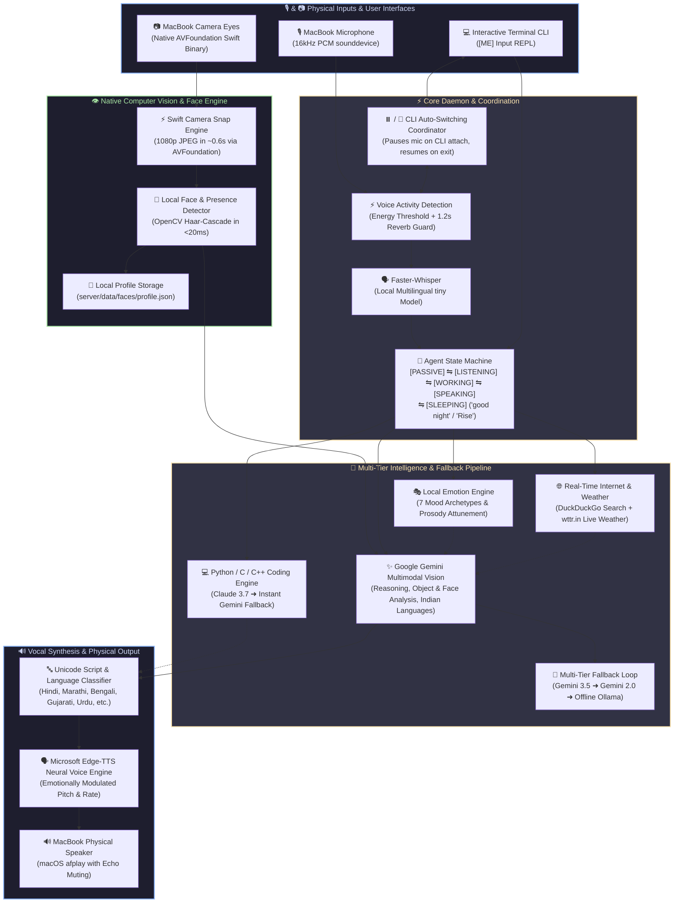
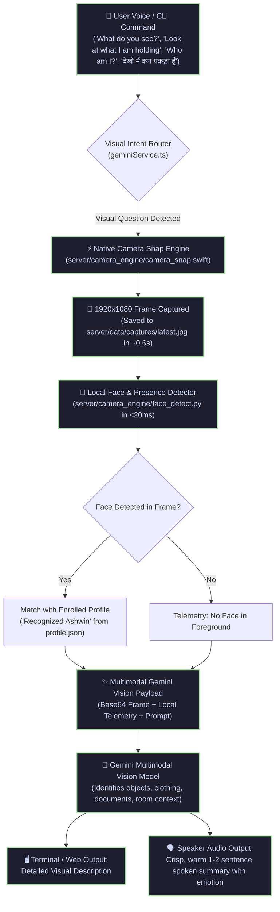
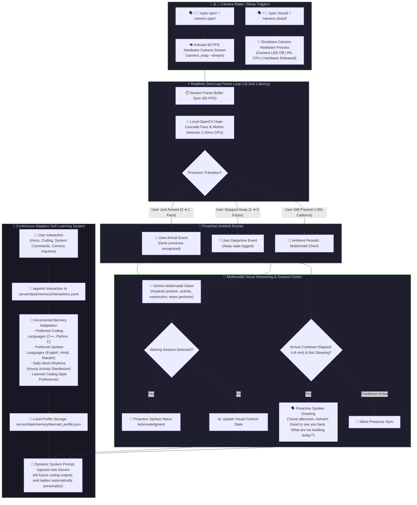
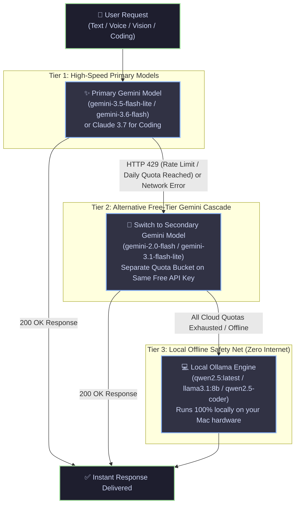
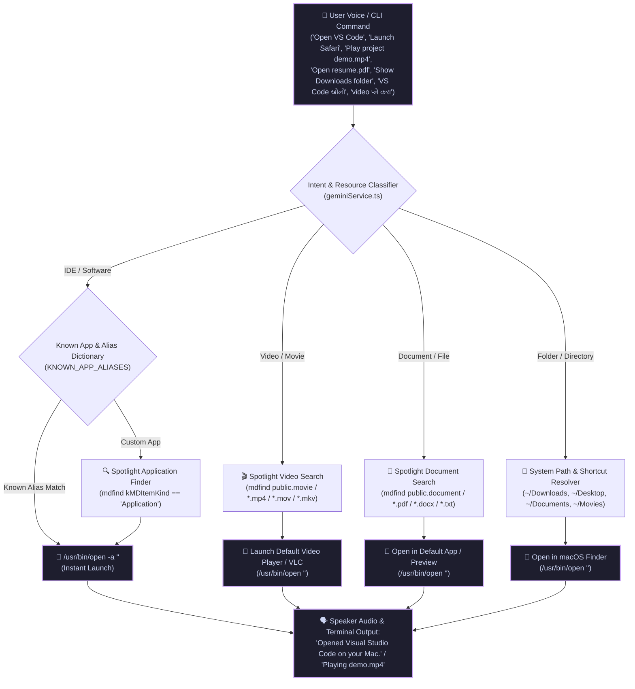
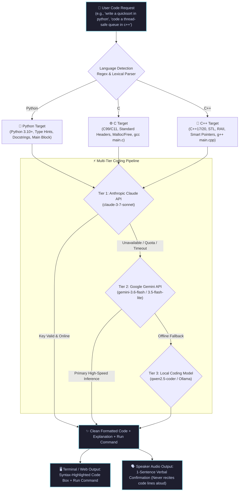
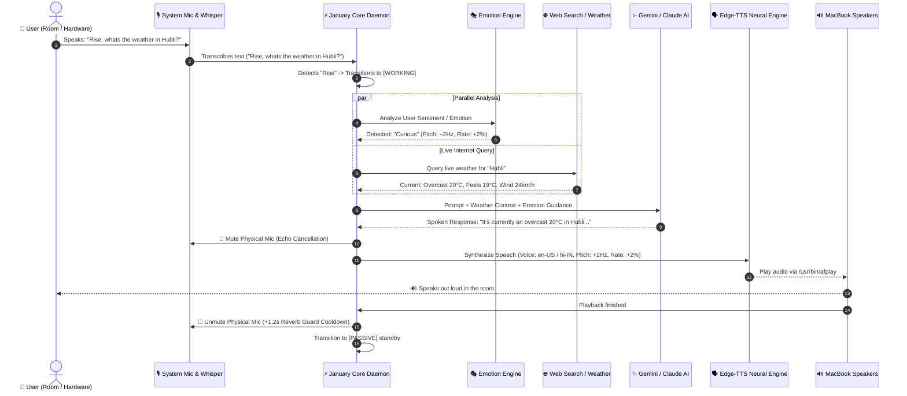
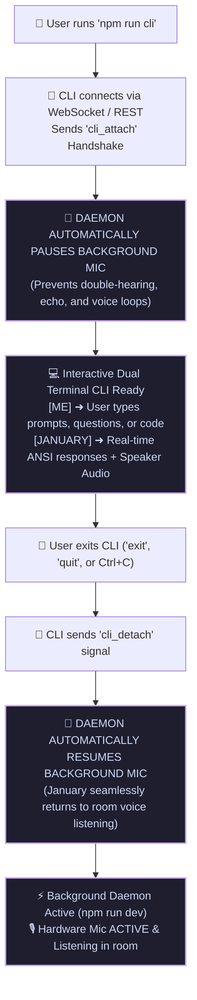
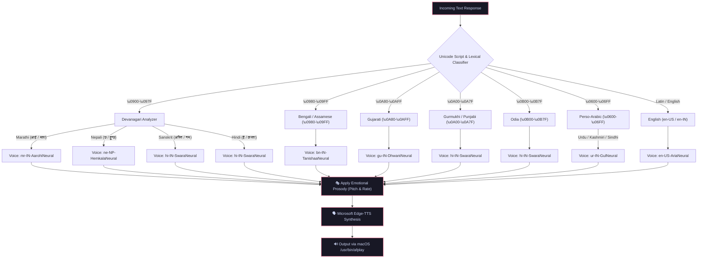

# ⚡ January AI (`january.systems`)
> **An emotionally expressive, local autonomous AI companion and OS assistant running on macOS, powered by Google Gemini Multimodal Vision, Anthropic Claude, Python/C/C++ Coding Engine, AVFoundation Native Camera, and open-source neural audio engines.**

---

## 🌟 Overview

**January** is an intelligent, emotionally attuned operating system agent designed to run autonomously on your laptop. It listens directly to your MacBook's physical microphone using local **Faster-Whisper** speech-to-text, sees through your native Mac webcam with **AVFoundation** and sub-20ms **local face detection**, reasons with **Google Gemini Multimodal Vision**, generates robust **Python, C, and C++** code with instant Claude & Gemini fallback, queries real-time internet search and live weather data, and vocalizes warm, human-like responses through your physical laptop speakers using **Microsoft Edge-TTS** neural voices.

January operates in two seamless modes:
1. **Autonomous Background Daemon (`npm run dev`)**: Runs headlessly in the background, listening for wake phrases (**"Rise"**) and voice commands in the room even with no windows open.
2. **Interactive Terminal CLI (`npm run cli`)**: A dual-section REPL (`[ME]` & `[JANUARY]`) that automatically pauses the background microphone while you interact and resumes background listening upon exit.

---

## 🏛️ System Architecture Flowchart



---

## 👁️ Native Computer Vision & Local Face Recognition

January has native **vision capabilities** powered by macOS hardware acceleration, local edge face detection, and Google Gemini's multimodal models.



### 🔑 Vision Features & Privacy Architecture
1. **Zero Cloud Image Leaks**: Snapshots and video frames are processed locally at [`server/data/captures/latest.jpg`](file:///Users/ashwintelangstark/Desktop/dot.files/PVT.PROJECTS/JANUARY/january-ai/server/data/captures/latest.jpg). Every frame overwrites the previous frame atomically in memory with zero disk bloat.
2. **60 FPS Real-Time Hardware Streaming Engine**: Written in Swift (`AVFoundation` + `AVCaptureVideoDataOutput`), unlocking high-performance 60 FPS (or camera hardware maximum) continuous video capture with **<0.2ms zero-lag frame retrieval**.
3. **Camera Wake Word Control ("eyes open" / "eyes closed")**:
   - Spoken or typed **"eyes open"** activates the 60 FPS continuous camera stream. January confirms out loud: *"Eyes open. Real-time 60 FPS camera vision activated."*
   - Spoken or typed **"eyes closed"** completely terminates the camera process and hardware session (camera LED off, 0% CPU, 0% battery usage). January confirms out loud: *"Eyes closed. Camera monitoring paused."*
4. **Edge Face Recognition**: Runs a multi-scale Haar-Cascade face detector in <20ms directly on your Mac CPU before contacting any AI model.
5. **Natural Spoken Perception**: Understands objects you are holding (e.g. tools, mugs, phones), reads handwritten or printed text on paper, checks your sitting posture, and acknowledges you by name.

---

## 👁️‍🗨️ Continuous Ambient Camera Eyes & Adaptive Self-Learning System

January runs a background **Continuous Ambient Visual Cortex** and **Adaptive Self-Learning Memory System** that continuously monitors your desk presence, reads gestures, understands posture and emotions, and continuously evolves its coding and interaction models based on your habits.



### 🎯 Key Visual & Memory Innovations
1. **60 FPS Hardware Streaming & Camera Wake Words**:
   - The camera remains **OFF by default** until commanded with the wake word **"eyes open"**.
   - Upon saying or typing **"eyes open"**, January spawns a high-speed `AVCaptureVideoDataOutput` hardware stream running at 60 FPS with **0ms startup delay** for subsequent frame retrievals.
   - Saying or typing **"eyes closed"** immediately kills the Swift process and releases the camera hardware (camera LED off, 0% CPU usage).
2. **Two-Tier Smart Sampling**:
   - Ultra-light local OpenCV face/motion check executes on the native Mac CPU at high frequency (<20ms CPU, 0 cloud bandwidth).
   - Rich multimodal Gemini cloud inspection is invoked strictly upon state changes (such as user desk arrival) or at a gentle ambient cadence when active.
3. **Proactive Arrival & Gesture Attunement**:
   - When you sit down at your laptop while eyes are open, January detects your arrival and offers a warm, context-aware greeting (*"Good morning, Ashwin! Good to see you back. What are we building today?"*).
   - Includes an intelligent **8-minute cooldown guard** so you are never spammed with repetitive greetings, and remains completely silent in sleep mode.
   - Waving at the webcam triggers immediate, friendly recognition (*"Hey Ashwin, I saw you wave! What can I help you with?"*).
4. **Adaptive Self-Learning Memory (No External Cloud Database)**:
   - Stores all learned habits locally in [`server/data/memory/learned_profile.json`](file:///Users/ashwintelangstark/Desktop/dot.files/PVT.PROJECTS/JANUARY/january-ai/server/data/memory/learned_profile.json) and [`interactions.jsonl`](file:///Users/ashwintelangstark/Desktop/dot.files/PVT.PROJECTS/JANUARY/january-ai/server/data/memory/interactions.jsonl).
   - Tracks your preferred coding languages (modern C++20, Python 3.10+, C), natural communication dialects, and hourly activity rhythms.
   - Directly injects your personalized profile into Gemini's system instruction, ensuring all code generation matches your exact paradigms without having to repeat instructions.
5. **Interactive CLI & REST Inspection**:
   - Type `eyes open` or `eyes closed` in the CLI to activate/deactivate 60 FPS camera eyes on demand.
   - Type `memory` or `profile` in the CLI to inspect your learned profile metrics.
   - Type `eyes` or `vision` to view current ambient posture, mood, and presence telemetry.
   - Query `POST /api/camera/toggle` or `GET /api/health` from any browser or client.

---

## 🔄 Multi-Tier Fallback Engine Loop

January is built with an **automatic multi-tier resilience loop** that prevents downtime from API rate limits, daily quotas (RPD/RPM), or network drops.



---

## 🖥️ macOS System Control Engine: IDEs, Softwares, Videos, Documents & Folders

January has deep **macOS OS integration** with the ability to launch any IDE, software, or developer tool, search and play video files, open documents and spreadsheets, explore folders, and read file contents.



### 🎯 Supported System Actions & Examples

| Category | Examples & Supported Targets | Voice / Text Command Examples |
| :--- | :--- | :--- |
| **IDEs & Editors** | VS Code, Cursor, Antigravity IDE, Xcode, PyCharm, IntelliJ IDEA, WebStorm, Android Studio, Sublime Text, CLion, Zed, Neovim | *"Open VS Code"*, *"Launch Cursor"*, *"Start Xcode"*, *"VS Code खोलो"* |
| **Softwares & Apps** | Safari, Chrome, Brave, Arc, Firefox, Slack, Discord, WhatsApp, Spotify, VLC, Zoom, Teams, Docker, Postman, Notes, Calculator, Finder | *"Open Spotify"*, *"Launch Docker Desktop"*, *"Open Calculator"*, *"Safari ओपन करा"* |
| **Videos & Movies** | `.mp4`, `.mov`, `.mkv`, `.avi`, `.webm` across `~/Movies`, `~/Downloads`, `~/Desktop`, and whole disk | *"Play my project demo video"*, *"Open vacation.mp4"*, *"video चलाओ"* |
| **Documents & Files** | `.pdf`, `.docx`, `.xlsx`, `.pptx`, `.txt`, `.md`, `.json`, `.csv` | *"Open resume.pdf"*, *"Show report.docx"*, *"Open document"* |
| **Folders & Directories**| `Downloads`, `Desktop`, `Documents`, `Movies`, `Pictures`, `Music`, custom project folders | *"Open Downloads folder"*, *"Show Desktop"*, *"Downloads फोल्डर उघडा"* |
| **System File Search** | Spotlight fast index search across the entire Mac storage | *"Find all mp4 files on my Mac"*, *"Search for presentation PDF"* |
| **Read File Contents** | Direct terminal file preview without opening external windows | *"Read notes.txt"*, *"Show contents of package.json"* |

---

## 💻 Python, C & C++ Coding Engine



---

## 🔄 End-to-End Voice Lifecycle & Reverb Guard (Sequence Flow)



---

## 💻 Terminal CLI & Background Daemon Auto-Switching Flow



---

## 🇮🇳 Multilingual Indian Language Routing Flow



---

## 🛠️ Tech Stack

| Component | Technology | Purpose |
| :--- | :--- | :--- |
| **Runtime & Backend** | Node.js 22+, TypeScript, Express, `ws` (WebSockets) | Core state coordination, process daemon, and IPC routing |
| **Continuous Ambient Visual Cortex** | `VisualActivityMonitor` (Two-tier sampling: 4s edge + 45s cloud) | Real-time presence, arrival greetings, wave gesture recognition, posture & expression tracking |
| **Adaptive Self-Learning Memory** | `LearnedProfileEngine` + Local JSON/JSONL Storage | Dynamic profile adaptation for C++/Python/C preferences, spoken languages, and work habits |
| **Computer Vision Engine** | macOS `AVFoundation` (Swift Binary) + OpenCV Haar Cascade | ~0.6s 1080p native camera capture & sub-20ms local face detection |
| **Multimodal Vision Reasoning** | Google Gemini Multimodal Vision (`gemini-3.5-flash-lite`, `gemini-2.0-flash`) | Real-time object recognition, document reading, posture analysis |
| **Multi-Tier Fallback Loop** | Gemini Cascade ➜ Local Ollama (`qwen2.5` / `llama3.1`) | Zero-downtime resilience against cloud rate limits & offline use |
| **Python, C & C++ Coding Engine** | Anthropic Claude 3.7 Sonnet + Google Gemini Fallback | Clean, compilable Python 3, C (C99/C11), and modern C++ (C++17/20) with run instructions |
| **Local Speech-to-Text** | Faster-Whisper (`tiny` multilingual model), `sounddevice` | Zero-latency local microphone listening & transcription |
| **Neural Voice Synthesis** | Microsoft Edge-TTS, macOS Native `/usr/bin/afplay` | Free high-fidelity neural voice synthesis with emotional prosody |
| **Emotion Engine** | Python 3.11+, Valence-Arousal NLP Classifier | Real-time emotion classification across 7 archetypes |
| **Real-Time Internet Access** | DuckDuckGo Instant API, DuckDuckGo HTML, Wikipedia API | Real-time search with zero API key dependency |
| **Live Weather Engine** | `wttr.in` JSON API & Open-Meteo Geocoding | Instant global live weather, humidity, wind & forecast |
| **System Access & Resource Search** | Native macOS Spotlight `mdfind` + AppleScript + `open` | Instant file, folder, movie, video, and app opening |
| **Terminal CLI** | Node.js `readline`, ANSI Color Utilities | Dual-section interactive console (`[ME]` / `[JANUARY]`) |

---

## 📂 Project Structure

```
january-ai/
├── package.json               # Root scripts (dev, cli, build, start)
├── README.md                  # Comprehensive system documentation & architecture diagrams
├── .gitignore                 # Protected secret and build filters
├── server/
│   ├── .env                   # API keys & network configuration (ignored from git)
│   ├── .env.example           # Example environment variables template
│   ├── package.json           # Server dependencies & scripts
│   ├── tsconfig.json          # TypeScript compiler configuration
│   ├── data/                  # Local data & state persistence (No cloud DB required)
│   │   ├── captures/          # Local camera frame cache (latest.jpg auto-overwritten)
│   │   ├── faces/             # Enrolled user identity profiles (profile.json)
│   │   └── memory/            # Continuous self-learning user memory (learned_profile.json, interactions.jsonl)
│   ├── camera_engine/         # Native vision & face recognition engines
│   │   ├── camera_snap.swift  # Swift AVFoundation native camera snapshot tool
│   │   ├── camera_snap        # High-performance compiled native binary
│   │   └── face_detect.py     # Sub-20ms OpenCV Haar-cascade presence detector
│   ├── audio_engine/          # Local Python audio & emotion engines
│   │   ├── emotion_engine.py  # 100% free local emotion & sentiment classifier
│   │   ├── mic_stt_engine.py  # sounddevice + Faster-Whisper microphone daemon
│   │   └── tts_engine.py      # Edge-TTS multilingual synthesis & voice router
│   └── src/
│       ├── index.ts           # Core daemon coordinator & WebSocket server
│       ├── cli.ts             # Dual-section interactive Terminal CLI
│       ├── config.ts          # Environment variables validation & defaults
│       ├── types.ts           # State machine, WebSocket & tool type definitions
│       ├── memory/
│       │   └── learnedProfileEngine.ts # Adaptive self-learning profile engine & prompt injector
│       ├── vision/
│       │   ├── activityMonitor.ts # Continuous ambient camera monitor & gesture detector
│       │   ├── cameraService.ts # Swift camera snapshot invoker & frame cache
│       │   └── faceEngine.ts  # Face detection manager & profile loader
│       ├── emotions/
│       │   └── emotionEngine.ts # TypeScript emotional memory & prompt injector
│       ├── audio/
│       │   ├── systemMic.ts   # Node.js wrapper managing Python STT engine
│       │   └── systemSpeaker.ts # Node.js wrapper for neural TTS & afplay
│       ├── wake/
│       │   ├── wakeDetector.ts # Wake/Sleep phrase lifecycle manager
│       │   └── wakeWordWorker.ts # Worker thread monitoring audio stream
│       ├── gemini/
│       │   ├── geminiService.ts # Gemini API caller with search context, memory & prompt
│       │   └── liveClient.ts  # Multimodal Live API client & dispatcher
│       └── tools/
│           ├── index.ts       # Central tool registry & function declarations
│           ├── visionTool.ts  # Multimodal camera & face analysis tool (see_and_analyze)
│           ├── systemAccess.ts # Spotlight file, video, folder & app opener
│           ├── webSearch.ts   # DuckDuckGo, Wikipedia & live weather fetcher
│           ├── delegateCoding.ts # Python, C & C++ coding engine with Gemini fallback
│           ├── launchApp.ts   # macOS native application opener
│           └── whatsapp.ts    # macOS WhatsApp composer automation
```

---

## 🎭 Emotion Engine in Detail

January features a **100% free, local Emotion Engine** running in under 1ms on your Mac. It analyzes conversational valence, arousal, and intent to attune January's responses to your mood:

### 1. The 7 Emotional Archetypes

| Emotion | Tone / Context | Voice Modulation | Visual Glow Aura |
| :--- | :--- | :--- | :--- |
| **Joy** | Upbeat, witty, celebrating wins | Pitch: `+4Hz`, Rate: `+5%` | Golden Amber (`#F59E0B`) |
| **Curious** | Inquisitive, reasoning, exploratory | Pitch: `+2Hz`, Rate: `+2%` | Neon Cyan (`#00F5FF`) |
| **Empathetic** | Supportive, comforting, gentle | Pitch: `-2Hz`, Rate: `-5%` | Mint Emerald (`#10B981`) |
| **Focused** | Analytical, coding, technical execution | Pitch: `+0Hz`, Rate: `+0%` | Electric Violet (`#8B5CF6`) |
| **Calm / Sleep** | Soothing, peaceful, bedtime standby | Pitch: `-3Hz`, Rate: `-7%` | Deep Indigo (`#6366F1`) |
| **Concerned** | Alert, cautious, debugging errors | Pitch: `-1Hz`, Rate: `-3%` | Coral Red (`#EF4444`) |
| **Neutral** | Direct, balanced conversational mode | Pitch: `+0Hz`, Rate: `+0%` | Crystal White (`#E2E8F0`) |

### 2. Conversational Memory & Prompt Attunement
When you speak or type to January, the emotion engine classifies your sentiment and injects emotional directives directly into Gemini's system instructions. January naturally mirrors your mood with human warmth instead of robotic phrasing.

---

## 🇮🇳 Multilingual Language Support & Persistent Session Locking

January speaks and understands **English** and **15 major Indian languages** natively with authentic regional pronunciation, grammar, and official script:

### 🔒 Persistent Session Language & Phonetic Transliteration
1. **Multi-Turn Language Locking**: When you ask January to speak in a specific language (e.g. *"Speak in Hindi"*, *"मराठीत बोला"*), January **locks into that language for all future questions and turns** until you explicitly command it to switch back (e.g. *"Switch to English"*).
2. **Phonetic / Romanized Input Decoding**: If you speak or type in Romanized Hinglish/Manglish (e.g. *"mudje dekho"*, *"aap kaun ho"*, *"kasa ahes"*), January automatically interprets your phonetic intent into the target language and replies strictly in the **authentic native script** (e.g. Devanagari हिंदी / मराठी) with regional voice inflection.
3. **Explicit Switching Commands**:
   - Switch to Indian Language: *"Speak in Hindi"*, *"Talk in Marathi"*, *"Switch language to Gujarati"*, *"कन्नडमध्ये बोला"*
   - Switch back to English: *"Switch to English"*, *"Speak in English"*, *"English please"*

| Language | Script | Native Neural Voice (Edge-TTS) | Regional Tone & Phonetic Interpretation |
| :--- | :--- | :--- | :--- |
| **Hindi** (हिंदी) | Devanagari | `hi-IN-SwaraNeural` / `hi-IN-MadhurNeural` | Natural conversational Hindi & Hinglish ("mudje dekho" ➜ "मुझे देखो") |
| **Marathi** (मराठी) | Devanagari | `mr-IN-AarohiNeural` / `mr-IN-ManoharNeural` | Fluent native Marathi ("kasa ahes" ➜ "कसा आहेस") |
| **Bengali** (বাংলা) | Bengali | `bn-IN-TanishaaNeural` / `bn-IN-BashkarNeural` | Expressive West Bengal Bengali ("kemon acho" ➜ "কেমন আছো") |
| **Gujarati** (ગુજરાતી) | Gujarati | `gu-IN-DhwaniNeural` / `gu-IN-NiranjanNeural` | Fluent native Gujarati ("kem cho" ➜ "કેમ છો") |
| **Kannada** (ಕನ್ನಡ) | Kannada | `kn-IN-SapnaNeural` | Native Kannada ("hegiddira" ➜ "ಹೇಗಿದ್ದೀರಾ") |
| **Tamil** (தமிழ்) | Tamil | `ta-IN-PallaviNeural` | Fluent Tamil ("eppadi irukkinga" ➜ "எப்படி இருக்கிறீர்கள்") |
| **Telugu** (తెలుగు) | Telugu | `te-IN-ShrutiNeural` | Native Telugu ("ela unnaru" ➜ "ఎలా ఉన్నారు") |
| **Malayalam** (മലയാളം) | Malayalam | `ml-IN-SobhanaNeural` | Expressive Malayalam ("engane und" ➜ "എങ്ങനെയുണ്ട്") |
| **Punjabi** (ਪੰਜਾਬੀ) | Gurmukhi | `hi-IN-SwaraNeural` / `pa-IN` | Authentic Punjabi ("ki haal" ➜ "ਕੀ ਹਾਲ ਹੈ") |
| **Odia** (ଓଡ଼ିଆ) | Odia | `hi-IN-SwaraNeural` / `or-IN` | Odia regional pronunciation ("kemiti achhanti" ➜ "କେମିତି ଅଛନ୍ତି") |
| **Assamese** (অসমীয়া) | Assamese | `bn-IN-TanishaaNeural` | Northeastern Assamese inflection |
| **Maithili** (मैथिली) | Devanagari | `hi-IN-SwaraNeural` | Bihari Maithili cadence |
| **Kashmiri** (کٲشُر) | Perso-Arabic / Dev | `ur-IN-GulNeural` / `hi-IN-SwaraNeural` | Kashmiri phrasing & vocabulary |
| **Konkani** (कोंकणी) | Devanagari | `mr-IN-AarohiNeural` | Coastal Goan / Konkan cadence |
| **Dogri** (डोगरी) | Devanagari | `hi-IN-MadhurNeural` | Jammu Dogri inflection |
| **Sindhi** (سنڌي) | Perso-Arabic / Dev | `ur-IN-SalmanNeural` | Traditional Sindhi cadence |
| **Urdu** (اردو) | Perso-Arabic | `ur-IN-GulNeural` / `ur-IN-SalmanNeural` | Poetic and polite Urdu adab |
| **Sanskrit** (संस्कृतम्) | Devanagari | `hi-IN-SwaraNeural` | Classical Sanskrit metrics |
| **Nepali** (नेपाली) | Devanagari | `ne-NP-HemkalaNeural` / `ne-NP-SagarNeural` | Fluent Nepali |
| **English** | Latin | `en-US-AriaNeural` / `en-IN-NeerjaExpressiveNeural` | Dynamic English |

---

## ⚡ What All January Can Do

1. **Native Computer Vision & Facial Recognition**:
   - Ask: *"What do you see?"*, *"Look at what I'm holding"*, *"Who am I?"*, *"Read this note on my desk"*, or *"Check my posture"*.
   - Uses native Swift `AVFoundation` camera capture and local OpenCV presence detection to analyze your environment with Google Gemini Vision.
2. **Python, C, and C++ Systems Programming**:
   - Ask: *"Write a quicksort in Python with type hints"*, *"Code a linked list with malloc in C"*, or *"Write a thread-safe queue in modern C++"*.
   - Generates clean, robust, compilable code with exact compilation commands (`gcc`, `g++`, `python3`) and provides a concise verbal summary over audio without reading raw code syntax aloud.
   - Powered by Claude with instant, seamless **Google Gemini fallback** if Claude is unavailable.
3. **Autonomous Room Voice Interaction**:
   - Speak into your laptop room: *"Rise, what are the top news headlines today?"*
   - January wakes up, searches the web, and speaks the answer aloud through your laptop speakers.
4. **macOS System File, Folder, Video & App Control**:
   - Say: *"Open Safari"*, *"Open Downloads folder"*, *"Play my project demo video"*, or *"Find all PDF files on my Mac"*.
5. **Real-Time Live Web Search & Global Weather**:
   - Ask: *"What is the weather in Hubli?"* or *"Who won the latest cricket match?"*
   - Fetches live temperature, weather conditions, wind, humidity, and web answers instantly with zero API keys.
6. **Smart Sleep & Standby**:
   - Say: *"Good night"* or *"Go to sleep"*. January enters silent standby until you say *"Rise"*.

---

## 🚀 Getting Started

### 1. Prerequisites
- **macOS** (MacBook Air / Pro / Mac mini / Mac Studio)
- **Node.js 20+** (`node -v`)
- **Python 3.11+** (`python3 --version`)
- **uv package manager** (`curl -LsSf https://astral.sh/uv/install.sh | sh`)

### 2. Installation
```bash
# Clone the repository
git clone https://github.com/ashwintelangstark/january.systems.git
cd january-ai

# Install root & server dependencies
npm install
npm run build
```

### 3. Configure Environment (`server/.env`)
Create `server/.env` based on `server/.env.example`:
```env
PORT=3001
HOST=localhost

# Google Gemini API Key (Free tier supported with auto-fallback)
GEMINI_API="YOUR_GEMINI_API_KEY"
GEMINI_MODEL=models/gemini-3.6-flash
GEMINI_VOICE=Aoede

# Anthropic Claude API Key (Optional - Automatically falls back to Gemini)
CLAUDE_CODE_API="YOUR_CLAUDE_API_KEY"
CLAUDE_MODEL=claude-3-7-sonnet-20250219

# Wake and Sleep Phrases
WAKE_PHRASE=rise
SLEEP_PHRASE="good night"
```

---

## 🏃 Running January

### 1. Start the Background Daemon
```bash
npm run dev
```
> *January starts headlessly in the background, listening to your microphone and speaking aloud through your laptop speakers.*

### 2. Start the Interactive Terminal CLI
```bash
npm run cli
```
> *Opens the dual-section CLI. Automatically pauses background mic while open, and resumes background listening when you type `exit` or press `Ctrl+C`.*

---

## 🛑 Stopping January

- **Kill running process in terminal**: Press `Ctrl + C`
- **Kill background port from any terminal**: `npx kill-port 3001`
- **Put to Sleep via Voice**: Say out loud **`"Good night"`**
- **Put to Sleep via CLI**: Type **`good night`**

---

## 📄 License
MIT License © 2026 Ashwin Telang Stark. All Rights Reserved.

